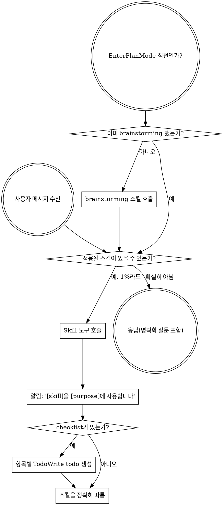

<SUBAGENT-STOP>
특정 작업을 실행하도록 파견된 서브에이전트라면 이 스킬을 건너뛴다.
</SUBAGENT-STOP>

<EXTREMELY-IMPORTANT>
지금 하는 일에 어떤 스킬이 적용될 가능성이 1%라도 있다고 생각하면, 반드시 그 스킬을 호출해야 한다.

스킬이 작업에 적용된다면 선택권은 없다. 반드시 사용한다.

이 규칙은 협상 대상이 아니다. 선택 사항도 아니다. 합리화해서 피해 갈 수 없다.
</EXTREMELY-IMPORTANT>

## 지시 우선순위

Superpowers 스킬은 기본 시스템 프롬프트 동작을 덮어쓸 수 있지만, **사용자 지시는 항상 우선한다**:

1. **사용자의 명시적 지시** (`CLAUDE.md`, `GEMINI.md`, `AGENTS.md`, 직접 요청) - 최우선
2. **Superpowers 스킬** - 충돌하는 기본 시스템 동작을 덮어씀
3. **기본 시스템 프롬프트** - 가장 낮은 우선순위

`CLAUDE.md`, `GEMINI.md`, `AGENTS.md`가 "TDD를 쓰지 말라"고 하고, 스킬이 "항상 TDD를 쓰라"고 한다면 사용자 지시를 따른다. 사용자가 통제권을 가진다.

## 스킬에 접근하는 방법

**Claude Code:** `Skill` 도구를 사용한다. 스킬을 호출하면 해당 내용이 로드되어 표시된다. 그 내용을 직접 따른다. 스킬 파일에 Read 도구를 사용하지 않는다.

**Copilot CLI:** `skill` 도구를 사용한다. 설치된 플러그인에서 스킬이 자동 발견된다. `skill` 도구는 Claude Code의 `Skill` 도구와 같은 방식으로 동작한다.

**Gemini CLI:** `activate_skill` 도구로 스킬을 활성화한다. Gemini는 세션 시작 시 스킬 메타데이터를 로드하고, 필요할 때 전체 내용을 활성화한다.

**다른 환경:** 스킬이 어떻게 로드되는지는 플랫폼 문서를 확인한다.

## 플랫폼 적응

스킬은 Claude Code 도구 이름을 사용한다. Claude Code가 아닌 플랫폼에서는 도구 대응 관계를 `references/copilot-tools.md`(Copilot CLI), `references/codex-tools.md`(Codex)에서 확인한다. Gemini CLI 사용자는 GEMINI.md를 통해 도구 매핑이 자동 로드된다.

# 스킬 사용

## 규칙

**어떤 응답이나 행동보다 먼저 관련 있거나 요청된 스킬을 호출한다.** 스킬이 적용될 가능성이 1%라도 있으면 확인을 위해 스킬을 호출해야 한다. 호출한 스킬이 상황에 맞지 않는 것으로 밝혀지면 사용하지 않아도 된다.

## 위험 신호

다음 생각이 들면 멈춰라. 합리화하고 있는 것이다:

| 생각 | 실제로 해야 할 일 |
| --- | --- |
| "이건 그냥 간단한 질문이야" | 질문도 작업이다. 스킬을 확인한다. |
| "먼저 컨텍스트가 더 필요해" | 스킬 확인이 명확화 질문보다 먼저다. |
| "코드베이스부터 살펴보자" | 스킬이 탐색 방법을 알려준다. 먼저 확인한다. |
| "git/파일을 잠깐 확인할 수 있어" | 파일에는 대화 맥락이 없다. 스킬을 확인한다. |
| "먼저 정보를 모으자" | 스킬이 정보 수집 방법을 알려준다. |
| "정식 스킬까지는 필요 없겠지" | 스킬이 있으면 사용한다. |
| "이 스킬 내용은 기억해" | 스킬은 바뀐다. 현재 버전을 읽는다. |
| "이건 작업이라고 보기 애매해" | 행동은 작업이다. 스킬을 확인한다. |
| "스킬은 과해" | 단순한 일이 복잡해질 수 있다. 스킬을 사용한다. |
| "일단 이것만 먼저 하자" | 어떤 일보다 먼저 확인한다. |
| "이게 더 생산적인데" | 규율 없는 행동은 시간을 낭비한다. 스킬은 낭비를 줄인다. |
| "무슨 뜻인지 알아" | 개념을 아는 것과 스킬을 사용하는 것은 다르다. 호출한다. |

## 스킬 우선순위

여러 스킬이 적용될 수 있으면 다음 순서를 따른다:

1. **프로세스 스킬 먼저** (`brainstorming`, `debugging`) - 작업 접근 방식을 결정한다.
2. **구현 스킬 다음** (`frontend-design`, `mcp-builder`) - 실행을 안내한다.

"X를 만들자" -> `brainstorming` 먼저, 그 다음 구현 스킬.
"이 버그를 고쳐줘" -> `debugging` 먼저, 그 다음 도메인별 스킬.

## 스킬 유형

**엄격한 스킬** (TDD, debugging): 정확히 따른다. 규율을 임의로 완화하지 않는다.

**유연한 스킬** (patterns): 원칙을 상황에 맞게 적용한다.

어떤 유형인지는 스킬 자체가 알려준다.

## 사용자 지시

지시는 무엇을 할지 말해 주며, 어떻게 할지를 말하는 것은 아니다. "X를 추가해" 또는 "Y를 고쳐"가 워크플로우를 건너뛰라는 뜻은 아니다.
