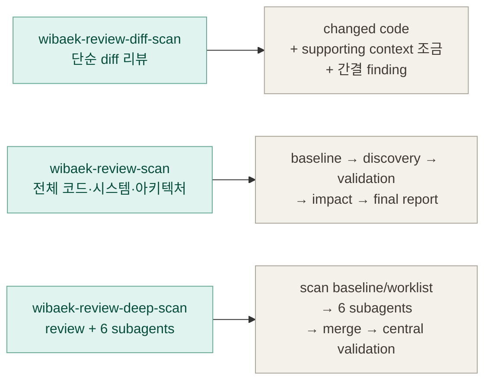
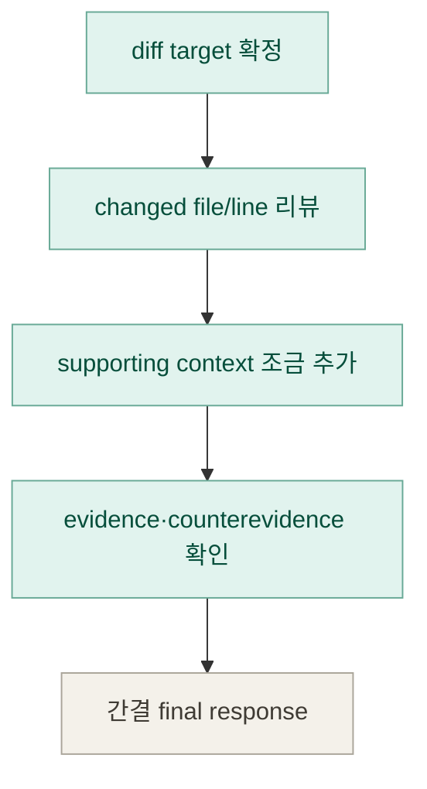
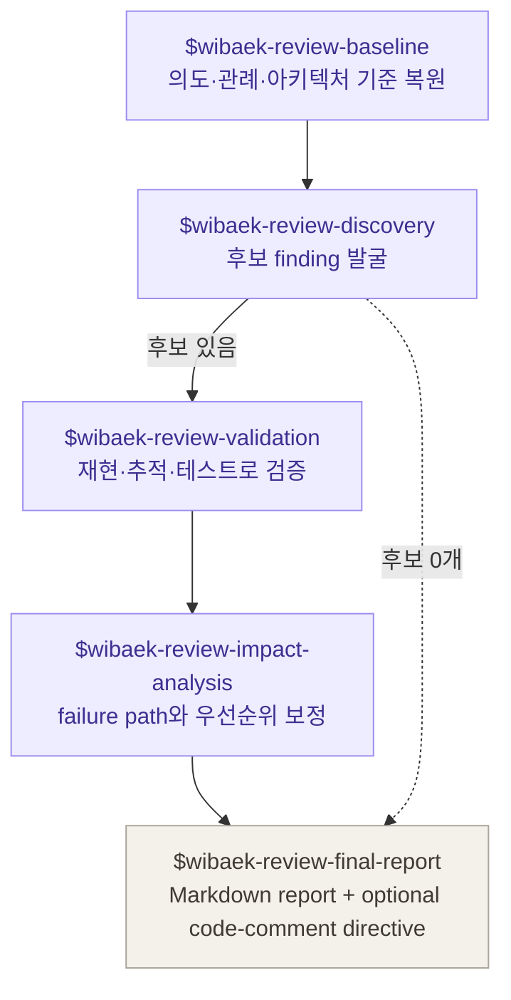
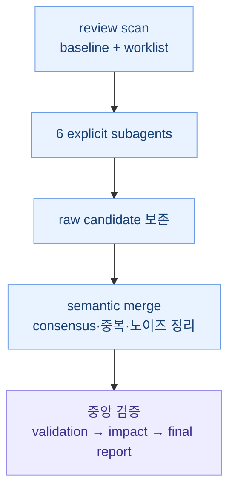

# Wibaek Code Review Workflow

`wibaek-code-review`는 보안 전용 scan을 범용 엔지니어링 리뷰로 일반화한 스킬 묶음이다.
diff review는 가볍게 PR feedback에 집중하고, review scan은 전체 코드/시스템/아키텍처를 본다.
deep review는 review scan에 6개 명시적 subagent 관점을 더한다.

## 전체 구조

## Diff Scan

`wibaek-review-diff-scan`은 ordinary PR feedback용이다.
formal artifact나 Codex goal을 만들지 않고, changed code와 필요한 supporting file만 조금 본다.

## Review Scan

`wibaek-review-scan`은 전체 코드, scoped module, 시스템 디자인, 아키텍처 디자인, ADR/RFC/design doc 리뷰용이다.
baseline, worklist, discovery, validation, impact analysis, final report의 경계를 유지한다.

## Deep Scan

`wibaek-review-deep-scan`은 review scan의 baseline/worklist를 공유하고 6개 subagent를 명시적으로 호출한다.
subagent 결과를 단순 union하지 않고 semantic merge 후 중앙 validation과 priority calibration을 거친다.

## 스킬 역할

| Skill | 역할 | top-level |
| --- | --- | --- |
| `wibaek-review-diff-scan` | PR, commit, branch diff, working-tree patch 단순 리뷰 진입점 | yes |
| `wibaek-review-scan` | 전체 코드, 시스템 디자인, 아키텍처 디자인, scoped module, ADR/RFC/design doc 리뷰 진입점 | yes |
| `wibaek-review-deep-scan` | review scan + 6개 명시적 subagent high-confidence 리뷰 진입점 | yes |
| `wibaek-review-baseline` | 취향 리뷰를 막기 위한 intent, convention, architecture 기준 복원 | no |
| `wibaek-review-discovery` | 후보 finding 발굴. 최종 priority나 reportability를 확정하지 않음 | no |
| `wibaek-review-validation` | 후보를 테스트, trace, graph, scenario로 확증하거나 반증 | no |
| `wibaek-review-impact-analysis` | 검증된 후보의 failure path, blast radius, irreversibility로 priority 보정 | no |
| `wibaek-review-final-report` | confirmed/rejected/deferred 결과를 최종 report와 directive로 조립 | no |

## 산출물 흐름

공유 reference는 루트 `references/` 아래에 있고, 각 스킬은 필요한 reference만 읽는다.

- `references/shared-hard-rules.md`: 모든 리뷰 단계의 공통 규칙
- `references/goal-setup.md`: repository/scoped scan과 deep review의 goal 및 completion 조건
- `references/artifact-paths.md`: baseline, candidate ledger, coverage ledger, final report 경로
- `references/candidate-schema.md`: discovery candidate와 validation receipt schema
- `references/authority-and-priority-policy.md`: authority basis와 priority calibration 기준
- `references/final-report.md`: 최종 report 형식

diff review와 작은 리뷰에서는 파일 artifact를 만들지 않고 final response 안에 evidence, validation, impact를 보존할 수 있다.
넓은 리뷰나 deep scan에서는 worklist, coverage ledger, candidate ledger가 있어야 "봤다"고 말할 수 있다.
