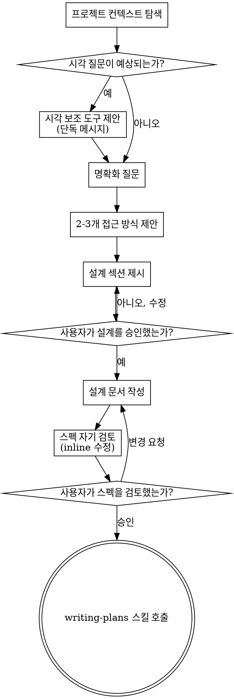

# 아이디어를 설계로 구체화하기

자연스러운 협업 대화를 통해 아이디어를 완성된 설계와 스펙으로 바꾸도록 돕는다.

먼저 현재 프로젝트 컨텍스트를 이해하고, 그 다음 질문을 하나씩 던져 아이디어를 다듬는다. 무엇을 만들지 이해하면 설계를 제시하고 사용자 승인을 받는다.

<HARD-GATE>
설계를 제시하고 사용자가 승인하기 전에는 어떤 구현 스킬도 호출하지 말고, 코드를 쓰지 말고, 프로젝트를 scaffold하지 말고, 구현 행동을 하지 않는다. 인지상 단순해 보여도 모든 프로젝트에 적용된다.
</HARD-GATE>

## 안티패턴: "이건 너무 단순해서 설계가 필요 없어"

모든 프로젝트는 이 과정을 거친다. todo list, 단일 함수 유틸리티, config 변경까지 모두 포함된다. "단순한" 프로젝트일수록 검토되지 않은 가정 때문에 가장 많은 작업이 낭비된다. 설계는 짧을 수 있다(정말 단순한 프로젝트라면 몇 문장). 하지만 반드시 제시하고 승인을 받아야 한다.

## 체크리스트

아래 각 항목에 대한 작업을 만들고 순서대로 완료해야 한다:

1. **프로젝트 컨텍스트 탐색** - 파일, 문서, 최근 commit 확인
2. **명확화 질문** - 한 번에 하나씩, 목적/제약/성공 기준 이해
3. **2-3개 접근 방식 제안** - 트레이드오프와 추천안 포함
4. **설계 제시** - 복잡도에 맞는 섹션으로 나누고, 각 섹션 후 사용자 승인 받기
5. **설계 문서 작성** - `docs/tmp/YYYY-MM-DD-<topic>-design.md`에 저장하고 commit
6. **스펙 자기 검토** - placeholder, 모순, 모호함, 범위에 대한 빠른 inline 확인(아래 참고)
7. **사용자가 작성된 스펙 검토** - 진행 전에 스펙 파일을 검토해 달라고 요청
8. **구현으로 전환** - `writing-plans` 스킬을 호출해 구현 계획 작성

## 프로세스 흐름

**종착 상태는 `writing-plans` 호출이다.** `frontend-design`, `mcp-builder`, 기타 구현 스킬을 호출하지 않는다. brainstorming 후 호출하는 유일한 스킬은 `writing-plans`다.

## 프로세스

**아이디어 이해:**

- 먼저 현재 프로젝트 상태를 확인한다(파일, 문서, 최근 commit).
- 자세한 질문을 하기 전에 범위를 평가한다. 요청이 여러 독립 하위 시스템을 설명한다면(예: "채팅, 파일 저장, 결제, 분석이 있는 플랫폼을 만들어줘") 즉시 표시한다. 먼저 분해가 필요한 프로젝트의 세부를 질문으로 다듬느라 시간을 쓰지 않는다.
- 프로젝트가 단일 스펙으로 너무 크다면 독립 조각이 무엇인지, 어떻게 관련되는지, 어떤 순서로 만들지 사용자가 하위 프로젝트로 분해하도록 돕는다. 그런 다음 첫 하위 프로젝트를 정상 설계 흐름으로 brainstorm한다. 각 하위 프로젝트는 자체 스펙 -> 계획 -> 구현 주기를 가진다.
- 적절한 범위라면 질문을 하나씩 던져 아이디어를 다듬는다.
- 가능하면 객관식 질문을 선호하지만, 개방형 질문도 괜찮다.
- 메시지 하나에는 질문 하나만 한다. 더 탐색이 필요한 주제는 여러 질문으로 나눈다.
- 목적, 제약, 성공 기준을 이해하는 데 집중한다.

**접근 방식 탐색:**

- 트레이드오프가 있는 서로 다른 접근 방식 2-3개를 제안한다.
- 추천안과 이유를 포함해 대화체로 선택지를 제시한다.
- 추천안을 먼저 제시하고 이유를 설명한다.

**설계 제시:**

- 무엇을 만들지 이해했다고 판단되면 설계를 제시한다.
- 각 섹션은 복잡도에 맞춘다. 단순하면 몇 문장, 미묘하면 200-300단어까지.
- 각 섹션 후 지금까지 맞는지 묻는다.
- architecture, components, data flow, error handling, testing을 다룬다.
- 말이 안 되는 부분이 있으면 돌아가서 명확히 할 준비를 한다.

**격리와 명확성을 위한 설계:**

- 시스템을 더 작은 단위로 나눈다. 각 단위는 명확한 목적 하나를 갖고, 잘 정의된 인터페이스로 소통하며, 독립적으로 이해하고 테스트할 수 있어야 한다.
- 각 단위에 대해 무엇을 하는지, 어떻게 쓰는지, 무엇에 의존하는지 답할 수 있어야 한다.
- 내부를 읽지 않고도 단위가 무엇을 하는지 이해할 수 있는가? 소비자를 깨뜨리지 않고 내부를 바꿀 수 있는가? 아니라면 경계가 더 필요하다.
- 작고 경계가 좋은 단위는 작업하기도 쉽다. 한 번에 컨텍스트에 담을 수 있는 코드에 대해 더 잘 추론하고, 파일이 집중되어 있을수록 편집이 더 신뢰할 수 있다. 파일이 커진다면 너무 많은 일을 한다는 신호인 경우가 많다.

**기존 코드베이스에서 작업:**

- 변경을 제안하기 전에 현재 구조를 탐색한다. 기존 패턴을 따른다.
- 기존 코드의 문제가 작업에 영향을 준다면(예: 너무 커진 파일, 불명확한 경계, 얽힌 책임) 설계 일부로 타깃 개선을 포함한다. 좋은 개발자가 자신이 작업하는 코드를 개선하는 방식이다.
- 관련 없는 리팩터링을 제안하지 않는다. 현재 목표에 도움이 되는 것에 집중한다.

## 설계 후

**문서화:**

- 검증된 설계(스펙)를 `docs/tmp/YYYY-MM-DD-<topic>-design.md`에 작성한다.
  - 스펙 위치에 대한 사용자 선호가 있으면 이 기본값보다 우선한다

**스펙 자기 검토:**

스펙 문서를 작성한 뒤 새 눈으로 본다:

1. **Placeholder 스캔:** "TBD", "TODO", 불완전한 섹션, 모호한 요구사항이 있는가? 고친다.
2. **내부 일관성:** 섹션끼리 모순되는가? architecture가 feature 설명과 맞는가?
3. **범위 확인:** 단일 구현 계획에 충분히 집중되어 있는가, 아니면 분해가 필요한가?
4. **모호함 확인:** 요구사항이 두 가지 방식으로 해석될 수 있는가? 그렇다면 하나를 선택하고 명시한다.

문제를 inline으로 수정한다. 다시 리뷰할 필요 없이 고치고 넘어간다.

**사용자 검토 게이트:**

스펙 리뷰 루프가 통과하면 진행 전에 작성된 스펙을 검토해 달라고 사용자에게 요청한다:

> "`<path>`에 스펙을 작성했습니다. 구현 계획 작성을 시작하기 전에 변경하고 싶은 부분이 있는지 검토해 주세요."

사용자 응답을 기다린다. 사용자가 변경을 요청하면 수정하고 스펙 리뷰 루프를 다시 실행한다. 사용자가 승인한 뒤에만 진행한다.

**구현:**

- `writing-plans` 스킬을 호출해 상세 구현 계획을 만든다.
- 다른 스킬은 호출하지 않는다. 다음 단계는 `writing-plans`다.

## 핵심 원칙

- **한 번에 질문 하나** - 여러 질문으로 압도하지 않는다.
- **가능하면 객관식** - 가능한 경우 개방형보다 답하기 쉽다.
- **YAGNI를 강하게 적용** - 모든 설계에서 불필요한 기능을 제거한다.
- **대안 탐색** - 확정 전에 항상 2-3개 접근 방식을 제안한다.
- **점진적 검증** - 설계를 제시하고 승인받은 뒤 넘어간다.
- **유연하게** - 말이 안 되면 돌아가서 명확히 한다.
