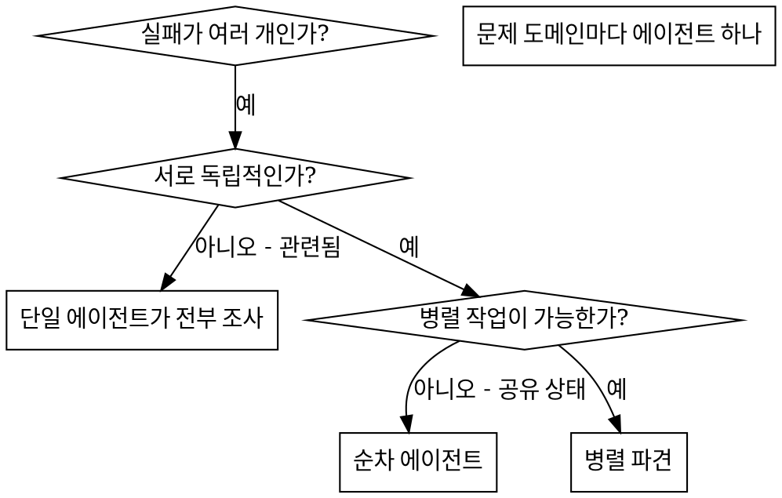

# 병렬 에이전트 파견

## 개요

작업을 격리된 컨텍스트를 가진 전문 에이전트에게 위임한다. 지시와 컨텍스트를 정확히 구성하면 각 에이전트가 자기 작업에 집중하고 성공할 수 있다. 에이전트가 현재 세션의 컨텍스트나 기록을 상속받아서는 안 된다. 필요한 것만 정확히 구성해 준다. 이렇게 하면 조율 작업을 위한 자신의 컨텍스트도 보존된다.

서로 다른 테스트 파일, 서로 다른 하위 시스템, 서로 다른 버그처럼 관련 없는 실패가 여러 개 있을 때 순차적으로 조사하면 시간이 낭비된다. 각 조사는 독립적이며 병렬로 진행할 수 있다.

**핵심 원칙:** 독립적인 문제 도메인마다 에이전트 하나를 파견한다. 동시에 작업하게 한다.

## 언제 사용할지



**사용할 때:**

- 서로 다른 원인의 테스트 파일 실패가 3개 이상 있음
- 여러 하위 시스템이 독립적으로 깨짐
- 각 문제를 다른 문제의 컨텍스트 없이 이해할 수 있음
- 조사 사이에 공유 상태가 없음

**사용하지 말 때:**

- 실패가 관련되어 있음. 하나를 고치면 다른 것도 고쳐질 수 있음
- 전체 시스템 상태를 이해해야 함
- 에이전트들이 서로 방해할 가능성이 있음

## 패턴

### 1. 독립 도메인 식별

무엇이 깨졌는지 기준으로 실패를 묶는다:

- File A 테스트: 도구 승인 흐름
- File B 테스트: 배치 완료 동작
- File C 테스트: 중단 기능

각 도메인은 독립적이다. 도구 승인을 고치는 일은 중단 테스트에 영향을 주지 않는다.

### 2. 초점이 분명한 에이전트 작업 만들기

각 에이전트는 다음을 받는다:

- **구체적 범위:** 테스트 파일 하나 또는 하위 시스템 하나
- **명확한 목표:** 해당 테스트를 통과시키기
- **제약:** 다른 코드를 변경하지 않기
- **기대 출력:** 발견한 것과 고친 것 요약

### 3. 병렬 파견

```typescript
// AI 환경
Task("Fix agent-tool-abort.test.ts failures");
Task("Fix batch-completion-behavior.test.ts failures");
Task("Fix tool-approval-race-conditions.test.ts failures");
// 세 작업은 모두 동시에 실행된다
```

### 4. 검토 및 통합

에이전트가 돌아오면:

- 각 요약을 읽는다.
- 수정이 충돌하지 않는지 확인한다.
- 전체 테스트 스위트를 실행한다.
- 모든 변경을 통합한다.

## 에이전트 프롬프트 구조

좋은 에이전트 프롬프트는 다음과 같다:

1. **초점이 분명함** - 명확한 문제 도메인 하나
2. **자기완결적임** - 문제 이해에 필요한 모든 컨텍스트 포함
3. **출력이 구체적임** - 에이전트가 무엇을 반환해야 하는지 명시

```markdown
`src/agents/agent-tool-abort.test.ts`의 실패 테스트 3개를 고친다:

1. "partial output capture와 함께 tool을 abort해야 함" - message에 'interrupted at'이 있기를 기대
2. "완료된 tool과 abort된 tool이 섞인 경우를 처리해야 함" - 빠른 tool이 완료되지 않고 abort됨
3. "pendingToolCount를 올바르게 추적해야 함" - 결과 3개를 기대하지만 0개를 받음

이것은 timing/race condition 이슈다. 당신의 작업:

1. 테스트 파일을 읽고 각 테스트가 무엇을 검증하는지 이해
2. 근본 원인 식별 - timing 이슈인가, 실제 bug인가?
3. 다음 방식으로 수정:
   - 임의 timeout을 event 기반 대기로 교체
   - abort 구현 bug가 발견되면 수정
   - 테스트 대상 동작이 바뀐 것이라면 test expectation 조정

timeout만 늘리지 말 것. 실제 이슈를 찾아라.

반환: 발견한 것과 수정한 것 요약.
```

## 흔한 실수

**❌ 너무 넓음:** "모든 테스트를 고쳐" - 에이전트가 길을 잃음
**✅ 구체적:** "`agent-tool-abort.test.ts`를 고쳐" - 범위가 좁음

**❌ 컨텍스트 없음:** "race condition을 고쳐" - 에이전트가 위치를 모름
**✅ 컨텍스트 있음:** 오류 메시지와 테스트 이름을 붙여넣음

**❌ 제약 없음:** 에이전트가 전부 리팩터링할 수 있음
**✅ 제약 있음:** "프로덕션 코드는 변경하지 말 것" 또는 "테스트만 수정"

**❌ 모호한 출력:** "고쳐" - 무엇이 바뀌었는지 알 수 없음
**✅ 구체적:** "근본 원인과 변경 요약을 반환"

## 사용하지 말아야 할 때

**관련된 실패:** 하나를 고치면 다른 것이 고쳐질 수 있다. 먼저 함께 조사한다.
**전체 컨텍스트 필요:** 이해하려면 전체 시스템을 봐야 한다.
**탐색적 디버깅:** 무엇이 깨졌는지 아직 모른다.
**공유 상태:** 에이전트들이 같은 파일을 편집하거나 같은 리소스를 사용해 서로 방해한다.

## 세션의 실제 예시

**상황:** 큰 리팩터링 후 3개 파일에서 테스트 실패 6개 발생

**실패:**

- `agent-tool-abort.test.ts`: 실패 3개(타이밍 문제)
- `batch-completion-behavior.test.ts`: 실패 2개(도구 미실행)
- `tool-approval-race-conditions.test.ts`: 실패 1개(실행 수 = 0)

**판단:** 독립 도메인이다. 중단 로직, 배치 완료, race condition은 분리되어 있다.

**파견:**

```text
Agent 1 -> agent-tool-abort.test.ts 수정
Agent 2 -> batch-completion-behavior.test.ts 수정
Agent 3 -> tool-approval-race-conditions.test.ts 수정
```

**결과:**

- Agent 1: timeout을 이벤트 기반 대기로 교체
- Agent 2: 이벤트 구조 버그 수정(`threadId` 위치 오류)
- Agent 3: 비동기 도구 실행 완료 대기 추가

**통합:** 모든 수정은 독립적이었고 충돌이 없었으며 전체 스위트가 green이 됨

**절약한 시간:** 순차 처리 대신 3개 문제를 병렬로 해결

## 핵심 이점

1. **병렬화** - 여러 조사가 동시에 진행된다.
2. **집중** - 각 에이전트의 범위가 좁아 추적할 컨텍스트가 적다.
3. **독립성** - 에이전트들이 서로 방해하지 않는다.
4. **속도** - 1개 문제를 해결하는 시간에 3개 문제를 해결한다.

## 검증

에이전트가 돌아온 뒤:

1. **각 요약 검토** - 무엇이 바뀌었는지 이해한다.
2. **충돌 확인** - 에이전트들이 같은 코드를 편집했는지 확인한다.
3. **전체 스위트 실행** - 모든 수정이 함께 작동하는지 검증한다.
4. **부분 확인** - 에이전트도 체계적인 실수를 할 수 있다.

## 실제 영향

디버깅 세션(2025-10-03):

- 3개 파일에서 실패 6개
- 3개 에이전트를 병렬 파견
- 모든 조사가 동시에 완료됨
- 모든 수정이 성공적으로 통합됨
- 에이전트 변경 사이 충돌 0개
