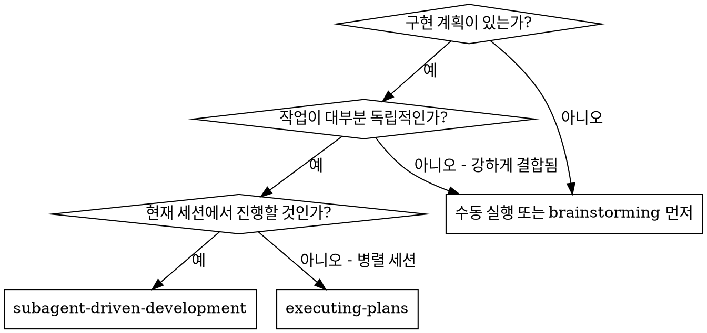
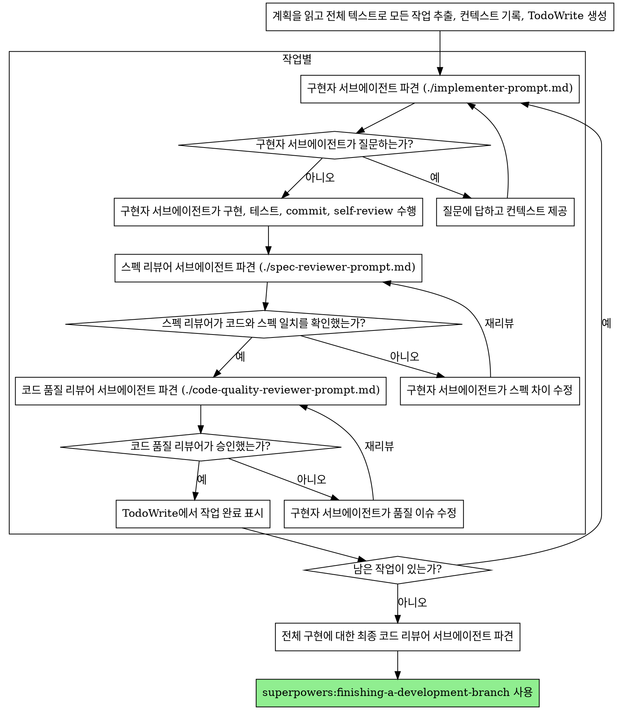

# 서브에이전트 주도 개발

작업마다 새 서브에이전트를 파견해 계획을 실행하고, 각 작업 후 두 단계 리뷰를 수행한다. 먼저 스펙 준수 리뷰, 그 다음 코드 품질 리뷰다.

**서브에이전트를 쓰는 이유:** 격리된 컨텍스트를 가진 전문 에이전트에게 작업을 위임한다. 지시와 컨텍스트를 정확히 구성하면 각 에이전트가 자기 작업에 집중하고 성공할 수 있다. 에이전트가 현재 세션의 컨텍스트나 기록을 상속받아서는 안 된다. 필요한 것만 정확히 구성해 준다. 이렇게 하면 조율 작업을 위한 자신의 컨텍스트도 보존된다.

**핵심 원칙:** 작업마다 새 서브에이전트 + 2단계 리뷰(스펙 후 품질) = 높은 품질, 빠른 반복

**연속 실행:** 작업 사이에 사람 파트너에게 확인하느라 멈추지 않는다. 계획의 모든 작업을 멈추지 않고 실행한다. 멈출 이유는 해결할 수 없는 BLOCKED 상태, 진행을 실제로 막는 모호함, 또는 모든 작업 완료뿐이다. "계속할까요?" 프롬프트와 진행 요약은 시간을 낭비한다. 사용자는 계획 실행을 요청했으므로 실행한다.

## 언제 사용할지



**Executing Plans(병렬 세션)와 비교:**

- 같은 세션(컨텍스트 전환 없음)
- 작업마다 새 서브에이전트(컨텍스트 오염 없음)
- 각 작업 후 2단계 리뷰: 스펙 준수 먼저, 코드 품질 다음
- 더 빠른 반복(작업 사이 사람 확인 없음)

## 프로세스



## 모델 선택

비용을 줄이고 속도를 높이기 위해 각 역할을 처리할 수 있는 가장 약한 모델을 사용한다.

**기계적 구현 작업**(격리된 함수, 명확한 스펙, 1-2개 파일): 빠르고 저렴한 모델을 사용한다. 계획이 잘 구체화되어 있으면 대부분의 구현 작업은 기계적이다.

**통합과 판단 작업**(여러 파일 조율, 패턴 매칭, 디버깅): 표준 모델을 사용한다.

**아키텍처, 설계, 리뷰 작업**: 사용 가능한 가장 유능한 모델을 사용한다.

**작업 복잡도 신호:**

- 완전한 스펙으로 1-2개 파일을 건드림 -> 저렴한 모델
- 통합 고려가 있는 여러 파일을 건드림 -> 표준 모델
- 설계 판단 또는 넓은 코드베이스 이해가 필요 -> 가장 유능한 모델

## 구현자 상태 처리

구현자 서브에이전트는 네 가지 상태 중 하나를 보고한다. 각 상태를 적절히 처리한다:

**DONE:** 스펙 준수 리뷰로 진행한다.

**DONE_WITH_CONCERNS:** 구현자가 작업을 완료했지만 의문을 표시했다. 진행 전에 우려를 읽는다. 우려가 정확성이나 범위에 관한 것이라면 리뷰 전에 해결한다. 관찰("이 파일이 커지고 있음" 등)이라면 메모하고 리뷰로 진행한다.

**NEEDS_CONTEXT:** 구현자가 제공되지 않은 정보가 필요하다. 빠진 컨텍스트를 제공하고 다시 파견한다.

**BLOCKED:** 구현자가 작업을 완료할 수 없다. 블로커를 평가한다:

1. 컨텍스트 문제라면 더 많은 컨텍스트를 제공하고 같은 모델로 다시 파견한다.
2. 작업에 더 많은 추론이 필요하다면 더 유능한 모델로 다시 파견한다.
3. 작업이 너무 크다면 더 작은 조각으로 나눈다.
4. 계획 자체가 틀렸다면 사람에게 에스컬레이션한다.

에스컬레이션을 무시하거나 같은 모델을 변경 없이 억지로 재시도시키지 않는다. 구현자가 막혔다고 했다면 바뀌어야 할 것이 있다.

## 프롬프트 템플릿

- `./implementer-prompt.md` - 구현자 서브에이전트 파견
- `./spec-reviewer-prompt.md` - 스펙 준수 리뷰어 서브에이전트 파견
- `./code-quality-reviewer-prompt.md` - 코드 품질 리뷰어 서브에이전트 파견

## 예시 워크플로우

```text
You: 이 계획을 실행하기 위해 Subagent-Driven Development를 사용합니다.

[계획 파일을 한 번 읽음: docs/tmp/feature-plan.md]
[전체 텍스트와 컨텍스트가 포함된 5개 작업 추출]
[모든 작업으로 TodoWrite 생성]

Task 1: Hook installation script

[Task 1 텍스트와 컨텍스트 확보(이미 추출됨)]
[전체 작업 텍스트 + 컨텍스트로 구현 서브에이전트 파견]

Implementer: "시작하기 전에 확인합니다. hook은 user level에 설치해야 하나요, system level에 설치해야 하나요?"

You: "User level (`~/.config/superpowers/hooks/`)입니다."

Implementer: "알겠습니다. 지금 구현합니다..."
[Later] Implementer:
  - install-hook command 구현
  - 테스트 추가, 5/5 통과
  - Self-review: --force flag 누락 발견 후 추가
  - commit 완료

[스펙 준수 리뷰어 파견]
Spec reviewer: ✅ 스펙 준수 - 모든 요구사항 충족, 추가 작업 없음

[git SHA 확보, 코드 품질 리뷰어 파견]
Code reviewer: 강점: test coverage가 좋고 깔끔함. 이슈: 없음. 승인.

[Task 1 완료 표시]

Task 2: Recovery modes

[Task 2 텍스트와 컨텍스트 확보(이미 추출됨)]
[전체 작업 텍스트 + 컨텍스트로 구현 서브에이전트 파견]

Implementer: [질문 없음, 진행]
Implementer:
  - verify/repair mode 추가
  - 8/8 테스트 통과
  - Self-review: 문제 없음
  - commit 완료

[스펙 준수 리뷰어 파견]
Spec reviewer: ❌ 이슈:
  - 누락: Progress reporting(스펙에 "100개마다 보고"라고 명시)
  - 추가: --json flag 추가됨(요청되지 않음)

[구현자가 이슈 수정]
Implementer: --json flag 제거, progress reporting 추가

[스펙 리뷰어 재검토]
Spec reviewer: ✅ 이제 스펙 준수

[코드 품질 리뷰어 파견]
Code reviewer: 강점: 탄탄함. 이슈(Important): magic number (100)

[구현자 수정]
Implementer: PROGRESS_INTERVAL constant 추출

[코드 리뷰어 재검토]
Code reviewer: ✅ 승인

[Task 2 완료 표시]

...

[모든 작업 후]
[최종 code-reviewer 파견]
Final reviewer: 모든 요구사항 충족, merge 준비 완료

완료!
```

## 장점

**수동 실행 대비:**

- 서브에이전트가 자연스럽게 TDD를 따른다.
- 작업마다 새 컨텍스트가 있어 혼란이 없다.
- 병렬 안전하다. 서브에이전트가 서로 방해하지 않는다.
- 서브에이전트가 작업 전과 작업 중 모두 질문할 수 있다.

**Executing Plans 대비:**

- 같은 세션에서 진행(인계 없음)
- 계속 진행(대기 없음)
- 리뷰 체크포인트 자동화

**효율 이점:**

- 파일 읽기 오버헤드 없음. 컨트롤러가 전체 텍스트를 제공한다.
- 컨트롤러가 필요한 컨텍스트만 정확히 선별한다.
- 서브에이전트가 처음부터 완전한 정보를 받는다.
- 질문이 작업 후가 아니라 시작 전에 드러난다.

**품질 게이트:**

- 자기 검토가 인계 전 문제를 잡는다.
- 2단계 리뷰: 스펙 준수, 그 다음 코드 품질
- 리뷰 루프가 수정이 실제로 작동하게 보장한다.
- 스펙 준수가 과소/과잉 구현을 막는다.
- 코드 품질이 구현이 잘 만들어졌는지 보장한다.

**비용:**

- 서브에이전트 호출이 늘어난다(작업마다 구현자 + 리뷰어 2명).
- 컨트롤러 준비 작업이 늘어난다(모든 작업을 upfront로 추출).
- 리뷰 루프가 반복을 추가한다.
- 하지만 문제를 일찍 잡는다. 나중에 디버깅하는 것보다 싸다.

## 위험 신호

**절대 하지 말 것:**

- 명시적 사용자 동의 없이 `main`/`master` 브랜치에서 구현 시작
- 리뷰 건너뛰기(스펙 준수 또는 코드 품질)
- 고쳐지지 않은 이슈를 두고 진행
- 여러 구현 서브에이전트를 병렬 파견(충돌)
- 서브에이전트가 계획 파일을 읽게 하기(전체 텍스트를 제공)
- 장면 설정 컨텍스트 건너뛰기(서브에이전트는 작업 위치를 이해해야 함)
- 서브에이전트 질문 무시(진행 전에 답하기)
- 스펙 준수에서 "close enough" 받아들이기(스펙 리뷰어가 이슈를 찾으면 완료 아님)
- 리뷰 루프 건너뛰기(리뷰어가 이슈 발견 -> 구현자 수정 -> 재리뷰)
- 구현자 자기 검토를 실제 리뷰로 대체하기(둘 다 필요)
- **스펙 준수가 ✅ 되기 전에 코드 품질 리뷰 시작하기**(순서 오류)
- 리뷰에 열린 이슈가 있는데 다음 작업으로 이동

**서브에이전트가 질문하면:**

- 명확하고 완전하게 답한다.
- 필요한 경우 추가 컨텍스트를 제공한다.
- 구현으로 서두르게 하지 않는다.

**리뷰어가 이슈를 찾으면:**

- 구현자(같은 서브에이전트)가 고친다.
- 리뷰어가 다시 리뷰한다.
- 승인될 때까지 반복한다.
- 재리뷰를 건너뛰지 않는다.

**서브에이전트가 작업에 실패하면:**

- 구체적인 지시와 함께 수정 서브에이전트를 파견한다.
- 직접 고치려 하지 않는다(컨텍스트 오염).

## 통합

**필수 워크플로우 스킬:**

- **superpowers:writing-plans** - 이 스킬이 실행할 계획을 만든다.
- **superpowers:requesting-code-review** - 리뷰어 서브에이전트용 코드 리뷰 템플릿
- **superpowers:finishing-a-development-branch** - 모든 작업 후 개발 완료

**대안 워크플로우:**

- **superpowers:executing-plans** - 같은 세션 실행 대신 병렬 세션에 사용
