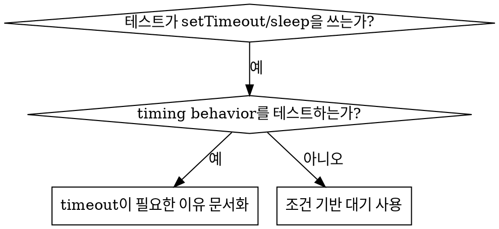

# 조건 기반 대기

## 개요

Flaky test는 임의 delay로 timing을 추측하는 경우가 많다. 이는 빠른 machine에서는 통과하지만 load나 CI에서는 실패하는 race condition을 만든다.

**핵심 원칙:** 얼마나 걸릴지 추측하지 말고, 실제로 관심 있는 조건을 기다린다.

## 언제 사용할지



**사용할 때:**

- 테스트에 임의 delay가 있음(`setTimeout`, `sleep`, `time.sleep()`)
- 테스트가 flaky함(때로 통과, load에서 실패)
- 병렬 실행 시 timeout 발생
- async operation 완료를 기다림

**사용하지 말 때:**

- 실제 timing behavior를 테스트함(debounce, throttle interval)
- 임의 timeout을 사용한다면 항상 왜 필요한지 문서화한다.

## 핵심 패턴

```typescript
// ❌ 이전: timing 추측
await new Promise(r => setTimeout(r, 50));
const result = getResult();
expect(result).toBeDefined();

// ✅ 이후: 조건 대기
await waitFor(() => getResult() !== undefined);
const result = getResult();
expect(result).toBeDefined();
```

## 빠른 패턴

| 시나리오 | Pattern |
| --- | --- |
| event 기다림 | `waitFor(() => events.find(e => e.type === 'DONE'))` |
| state 기다림 | `waitFor(() => machine.state === 'ready')` |
| count 기다림 | `waitFor(() => items.length >= 5)` |
| file 기다림 | `waitFor(() => fs.existsSync(path))` |
| 복합 조건 | `waitFor(() => obj.ready && obj.value > 10)` |

## 구현

Generic polling 함수:

```typescript
async function waitFor<T>(
  condition: () => T | undefined | null | false,
  description: string,
  timeoutMs = 5000
): Promise<T> {
  const startTime = Date.now();

  while (true) {
    const result = condition();
    if (result) return result;

    if (Date.now() - startTime > timeoutMs) {
      throw new Error(`Timeout waiting for ${description} after ${timeoutMs}ms`);
    }

    await new Promise(r => setTimeout(r, 10)); // 10ms마다 polling
  }
}
```

실제 디버깅 세션의 domain-specific helper(`waitForEvent`, `waitForEventCount`, `waitForEventMatch`)를 포함한 완전한 구현은 이 디렉터리의 `condition-based-waiting-example.ts`를 본다.

## 흔한 실수

**❌ 너무 빠른 polling:** `setTimeout(check, 1)` - CPU 낭비
**✅ 수정:** 10ms마다 polling

**❌ timeout 없음:** 조건이 충족되지 않으면 영원히 loop
**✅ 수정:** 항상 명확한 error가 있는 timeout 포함

**❌ stale data:** loop 전에 state cache
**✅ 수정:** loop 안에서 getter를 호출해 fresh data 사용

## 임의 timeout이 맞는 경우

```typescript
// Tool은 100ms마다 tick - partial output 검증에 tick 2번 필요
await waitForEvent(manager, 'TOOL_STARTED'); // 먼저 condition 대기
await new Promise(r => setTimeout(r, 200));   // 그다음 timed behavior 대기
// 200ms = 100ms 간격 tick 2번 - 문서화되고 정당화됨
```

**요구사항:**

1. 먼저 trigger condition을 기다린다.
2. 알려진 timing에 기반한다(추측 아님).
3. 왜 필요한지 설명하는 comment를 단다.

## 실제 영향

디버깅 세션(2025-10-03):

- 3개 파일에서 flaky test 15개 수정
- 통과율: 60% -> 100%
- 실행 시간: 40% 더 빠름
- race condition 제거
