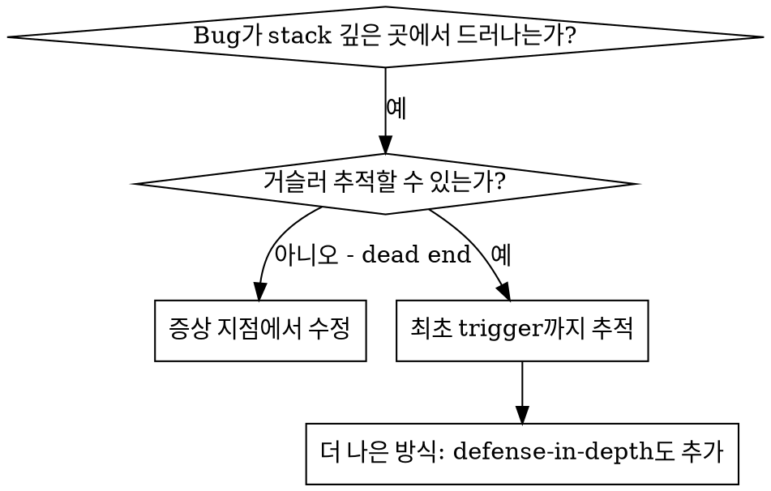
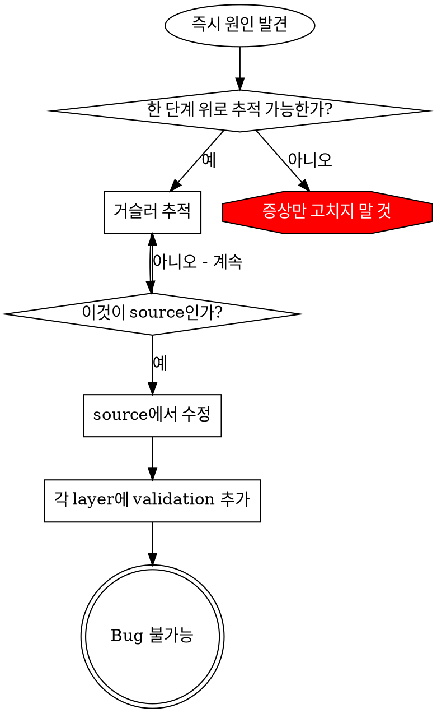

# 근본 원인 추적

## 개요

Bug는 call stack 깊은 곳에서 드러나는 경우가 많다(잘못된 directory에서 git init, 잘못된 위치에 file 생성, 잘못된 path로 database open). 본능은 error가 보이는 곳을 고치는 것이지만, 그것은 증상 처리다.

**핵심 원칙:** 최초 trigger를 찾을 때까지 call chain을 거슬러 추적한 뒤 source에서 고친다.

## 언제 사용할지



**사용할 때:**

- error가 entry point가 아니라 execution 깊은 곳에서 발생
- stack trace가 긴 call chain을 보여줌
- invalid data가 어디서 시작됐는지 불명확
- 어떤 test/code가 문제를 trigger하는지 찾아야 함

## 추적 프로세스

### 1. 증상 관찰

```text
Error: git init failed in ~/project/packages/core
```

### 2. 즉시 원인 찾기

**어떤 code가 직접 이것을 일으키는가?**

```typescript
await execFileAsync('git', ['init'], { cwd: projectDir });
```

### 3. 묻기: 무엇이 이것을 호출했나?

```typescript
WorktreeManager.createSessionWorktree(projectDir, sessionId)
  → Session.initializeWorkspace()가 호출
  → Session.create()가 호출
  → Project.create() 지점에서 test가 호출
```

### 4. 계속 위로 추적

**어떤 값이 전달됐는가?**

- `projectDir = ''`(empty string!)
- `cwd`의 empty string은 `process.cwd()`로 해석된다.
- 그것이 source code directory다.

### 5. 최초 trigger 찾기

**empty string은 어디서 왔는가?**

```typescript
const context = setupCoreTest(); // { tempDir: '' } 반환
Project.create('name', context.tempDir); // beforeEach 전에 접근됨!
```

## Stack Trace 추가

수동으로 추적할 수 없다면 instrumentation을 추가한다:

```typescript
// 문제가 되는 operation 전
async function gitInit(directory: string) {
  const stack = new Error().stack;
  console.error('DEBUG git init:', {
    directory,
    cwd: process.cwd(),
    nodeEnv: process.env.NODE_ENV,
    stack,
  });

  await execFileAsync('git', ['init'], { cwd: directory });
}
```

**중요:** 테스트에서는 logger가 아니라 `console.error()`를 사용한다. logger는 표시되지 않을 수 있다.

**실행 및 캡처:**

```bash
pnpm test 2>&1 | grep 'DEBUG git init'
```

**stack trace 분석:**

- test file 이름 찾기
- 호출을 trigger한 line number 찾기
- pattern 식별(같은 test? 같은 parameter?)

## 어떤 Test가 오염을 일으키는지 찾기

test 중 무언가가 생기는데 어떤 test인지 모를 때:

이 디렉터리의 bisection script `find-polluter.sh`를 사용한다:

```bash
./find-polluter.sh '.git' 'src/**/*.test.ts'
```

test를 하나씩 실행하고 첫 polluter에서 멈춘다. 사용법은 script를 본다.

## 실제 예시: Empty projectDir

**증상:** `.git`이 `packages/core/`(source code)에 생성됨

**추적 chain:**

1. `git init`이 `process.cwd()`에서 실행됨 <- empty cwd parameter
2. WorktreeManager가 empty projectDir로 호출됨
3. Session.create()에 empty string 전달
4. test가 beforeEach 전에 `context.tempDir`에 접근
5. setupCoreTest()가 초기에 `{ tempDir: '' }` 반환

**근본 원인:** top-level variable initialization이 empty value에 접근

**수정:** `beforeEach` 전에 접근하면 throw하는 getter로 tempDir 변경

**Defense-in-depth도 추가:**

- Layer 1: `Project.create()`가 directory 검증
- Layer 2: `WorkspaceManager`가 empty 검증
- Layer 3: `NODE_ENV` guard가 tmpdir 밖 git init 거부
- Layer 4: git init 전 stack trace logging

## 핵심 원칙



**error가 보이는 곳만 고치지 않는다.** 최초 trigger를 찾기 위해 거슬러 추적한다.

## Stack Trace 팁

**테스트에서:** logger가 아니라 `console.error()`를 사용한다. logger는 suppress될 수 있다.
**operation 전:** 실패 후가 아니라 위험한 operation 전에 log한다.
**context 포함:** directory, cwd, environment variable, timestamp
**stack 캡처:** `new Error().stack`은 전체 call chain을 보여준다.

## 실제 영향

디버깅 세션(2025-10-03):

- 5-level trace로 root cause 발견
- source에서 수정(getter validation)
- defense layer 4개 추가
- 1847개 test 통과, 오염 0개
