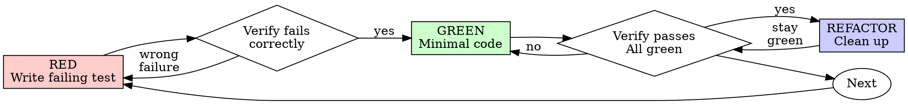

# 테스트 주도 개발(TDD)

## 개요

테스트를 먼저 작성한다. 실패를 확인한다. 통과시키는 최소 코드를 작성한다.

**핵심 원칙:** 테스트가 실패하는 것을 직접 보지 않았다면, 그 테스트가 올바른 것을 검증하는지 알 수 없다.

**규칙의 글자를 어기는 것은 규칙의 정신을 어기는 것이다.**

## 언제 사용할지

**필요시:**

- 새 기능
- 버그 수정
- 리팩터링
- 동작 변경

**예외(사람 파트너에게 물어본다):**

- 버릴 prototype
- 생성된 코드
- 설정 파일

## 철칙

```text
실패하는 테스트가 먼저 없으면 프로덕션 코드를 쓰지 않는다
```

테스트보다 먼저 코드를 썼는가? 삭제한다. 처음부터 다시 한다.

**예외 없음:**

- "참고용"으로 남기지 않는다.
- 테스트를 쓰면서 "adapt"하지 않는다.
- 쳐다보지 않는다.
- 삭제는 삭제다.

테스트에서 새로 구현한다. 끝.

## Red-Green-Refactor



### RED - 실패하는 테스트 작성

일어나야 할 일을 보여주는 최소 테스트 하나를 작성한다.

<Good>

```typescript
test("retries failed operations 3 times", async () => {
  let attempts = 0;
  const operation = () => {
    attempts++;
    if (attempts < 3) throw new Error("fail");
    return "success";
  };

  const result = await retryOperation(operation);

  expect(result).toBe("success");
  expect(attempts).toBe(3);
});
```

명확한 이름, 실제 동작 테스트, 한 가지 검증
</Good>

<Bad>

```typescript
test("retry works", async () => {
  const mock = jest
    .fn()
    .mockRejectedValueOnce(new Error())
    .mockRejectedValueOnce(new Error())
    .mockResolvedValueOnce("success");
  await retryOperation(mock);
  expect(mock).toHaveBeenCalledTimes(3);
});
```

모호한 이름, 코드가 아니라 mock을 테스트
</Bad>

**요구사항:**

- 동작 하나
- 명확한 이름
- 실제 코드(불가피한 경우가 아니면 mock 없음)

### RED 검증 - 실패를 확인

**필수. 절대 건너뛰지 않는다.**

```bash
pnpm test path/to/test.test.ts
```

확인할 것:

- 테스트가 실패한다(error가 아니라 fail)
- 실패 메시지가 예상과 맞다.
- 오타가 아니라 기능 누락 때문에 실패한다.

**테스트가 통과하는가?** 기존 동작을 테스트하고 있다. 테스트를 고친다.

**테스트가 error인가?** error를 고치고 올바르게 실패할 때까지 다시 실행한다.

### GREEN - 최소 코드

테스트를 통과시키는 가장 단순한 코드를 작성한다.

<Good>

```typescript
async function retryOperation<T>(fn: () => Promise<T>): Promise<T> {
  for (let i = 0; i < 3; i++) {
    try {
      return await fn();
    } catch (e) {
      if (i === 2) throw e;
    }
  }
  throw new Error("unreachable");
}
```

통과에 필요한 만큼만
</Good>

<Bad>

```typescript
async function retryOperation<T>(
  fn: () => Promise<T>,
  options?: {
    maxRetries?: number;
    backoff?: "linear" | "exponential";
    onRetry?: (attempt: number) => void;
  },
): Promise<T> {
  // YAGNI
}
```

과한 설계
</Bad>

테스트 범위를 넘는 기능 추가, 다른 코드 리팩터링, "개선"을 하지 않는다.

### GREEN 검증 - 통과 확인

**필수.**

```bash
pnpm test path/to/test.test.ts
```

확인할 것:

- 테스트가 통과한다.
- 다른 테스트도 여전히 통과한다.
- 출력이 깨끗하다(error, warning 없음).

**테스트가 실패하는가?** 테스트가 아니라 코드를 고친다.

**다른 테스트가 실패하는가?** 지금 고친다.

### REFACTOR - 정리

green 이후에만:

- 중복 제거
- 이름 개선
- helper 추출

테스트를 green으로 유지한다. 동작을 추가하지 않는다.

### 반복

다음 기능에 대한 다음 실패 테스트를 작성한다.

## 좋은 테스트

| 품질          | 좋음                                   | 나쁨                                                |
| ------------- | -------------------------------------- | --------------------------------------------------- |
| **최소성**    | 한 가지. 이름에 "and"가 있으면 나눈다. | `test('validates email and domain and whitespace')` |
| **명확성**    | 이름이 동작을 설명한다.                | `test('test1')`                                     |
| **의도 표시** | 원하는 API를 보여준다.                 | 코드가 무엇을 해야 하는지 가린다.                   |

## 예시: 버그 수정

**버그:** 빈 email이 허용됨

**RED**

```typescript
test("rejects empty email", async () => {
  const result = await submitForm({ email: "" });
  expect(result.error).toBe("Email required");
});
```

**RED 검증**

```bash
$ pnpm test
FAIL: expected 'Email required', got undefined
```

**GREEN**

```typescript
function submitForm(data: FormData) {
  if (!data.email?.trim()) {
    return { error: "Email required" };
  }
  // ...
}
```

**GREEN 검증**

```bash
$ pnpm test
PASS
```

**REFACTOR**

필요하면 여러 field에 대한 validation을 추출한다.

## 검증 체크리스트

작업 완료 표시 전에:

- [ ] 모든 새 함수/메서드에 테스트가 있음
- [ ] 각 테스트가 구현 전에 실패하는 것을 봄
- [ ] 각 테스트가 예상한 이유로 실패함(오타가 아니라 기능 누락)
- [ ] 각 테스트를 통과시키는 최소 코드 작성
- [ ] 모든 테스트 통과
- [ ] 출력이 깨끗함(error, warning 없음)
- [ ] 테스트가 실제 코드 사용(mock은 불가피할 때만)
- [ ] edge case와 error가 커버됨

모든 항목을 체크할 수 없다면 TDD를 건너뛴 것이다. 다시 시작한다.

## 막혔을 때

| 문제                   | 해결                                                           |
| ---------------------- | -------------------------------------------------------------- |
| 어떻게 테스트할지 모름 | 원하는 API를 쓴다. assertion부터 쓴다. 사람 파트너에게 묻는다. |
| 테스트가 너무 복잡함   | 설계가 너무 복잡하다. 인터페이스를 단순화한다.                 |
| 모든 것을 mock해야 함  | 코드가 너무 결합되어 있다. dependency injection을 사용한다.    |
| 테스트 setup이 거대함  | helper를 추출한다. 그래도 복잡하면 설계를 단순화한다.          |

## 디버깅 통합

버그가 발견됐는가? 그것을 재현하는 실패 테스트를 작성한다. TDD cycle을 따른다. 테스트가 수정과 회귀 방지를 증명한다.

테스트 없이 버그를 고치지 않는다.

## 테스트 안티패턴

mock이나 test utility를 추가할 때는 흔한 함정을 피한다:

- 실제 동작이 아니라 mock 동작을 테스트
- production class에 test-only method 추가
- dependency 이해 없이 mock
