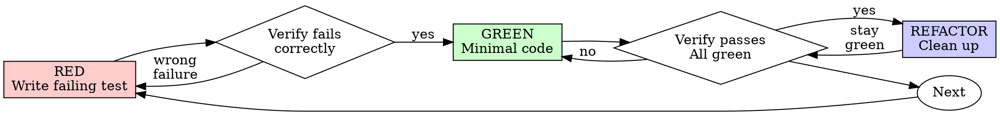

# 테스트 주도 개발(TDD)

## 개요

테스트를 먼저 작성한다. 실패를 확인한다. 통과시키는 최소 코드를 작성한다.

**핵심 원칙:** 테스트가 실패하는 것을 직접 보지 않았다면, 그 테스트가 올바른 것을 검증하는지 알 수 없다.

**규칙의 글자를 어기는 것은 규칙의 정신을 어기는 것이다.**

## 언제 사용할지

**항상:**

- 새 기능
- 버그 수정
- 리팩터링
- 동작 변경

**예외(사람 파트너에게 물어본다):**

- 버릴 prototype
- 생성된 코드
- 설정 파일

"이번 한 번만 TDD를 건너뛰자"는 생각이 들면 멈춘다. 그것은 합리화다.

## 철칙

```text
실패하는 테스트가 먼저 없으면 프로덕션 코드를 쓰지 않는다
```

테스트보다 먼저 코드를 썼는가? 삭제한다. 처음부터 다시 한다.

**예외 없음:**

- "참고용"으로 남기지 않는다.
- 테스트를 쓰면서 "adapt"하지 않는다.
- 쳐다보지 않는다.
- 삭제는 삭제다.

테스트에서 새로 구현한다. 끝.

## Red-Green-Refactor



### RED - 실패하는 테스트 작성

일어나야 할 일을 보여주는 최소 테스트 하나를 작성한다.

<Good>

```typescript
test('retries failed operations 3 times', async () => {
  let attempts = 0;
  const operation = () => {
    attempts++;
    if (attempts < 3) throw new Error('fail');
    return 'success';
  };

  const result = await retryOperation(operation);

  expect(result).toBe('success');
  expect(attempts).toBe(3);
});
```

명확한 이름, 실제 동작 테스트, 한 가지 검증
</Good>

<Bad>

```typescript
test('retry works', async () => {
  const mock = jest.fn()
    .mockRejectedValueOnce(new Error())
    .mockRejectedValueOnce(new Error())
    .mockResolvedValueOnce('success');
  await retryOperation(mock);
  expect(mock).toHaveBeenCalledTimes(3);
});
```

모호한 이름, 코드가 아니라 mock을 테스트
</Bad>

**요구사항:**

- 동작 하나
- 명확한 이름
- 실제 코드(불가피한 경우가 아니면 mock 없음)

### RED 검증 - 실패를 확인

**필수. 절대 건너뛰지 않는다.**

```bash
npm test path/to/test.test.ts
```

확인할 것:

- 테스트가 실패한다(error가 아니라 fail)
- 실패 메시지가 예상과 맞다.
- 오타가 아니라 기능 누락 때문에 실패한다.

**테스트가 통과하는가?** 기존 동작을 테스트하고 있다. 테스트를 고친다.

**테스트가 error인가?** error를 고치고 올바르게 실패할 때까지 다시 실행한다.

### GREEN - 최소 코드

테스트를 통과시키는 가장 단순한 코드를 작성한다.

<Good>

```typescript
async function retryOperation<T>(fn: () => Promise<T>): Promise<T> {
  for (let i = 0; i < 3; i++) {
    try {
      return await fn();
    } catch (e) {
      if (i === 2) throw e;
    }
  }
  throw new Error('unreachable');
}
```

통과에 필요한 만큼만
</Good>

<Bad>

```typescript
async function retryOperation<T>(
  fn: () => Promise<T>,
  options?: {
    maxRetries?: number;
    backoff?: 'linear' | 'exponential';
    onRetry?: (attempt: number) => void;
  }
): Promise<T> {
  // YAGNI
}
```

과한 설계
</Bad>

테스트 범위를 넘는 기능 추가, 다른 코드 리팩터링, "개선"을 하지 않는다.

### GREEN 검증 - 통과 확인

**필수.**

```bash
npm test path/to/test.test.ts
```

확인할 것:

- 테스트가 통과한다.
- 다른 테스트도 여전히 통과한다.
- 출력이 깨끗하다(error, warning 없음).

**테스트가 실패하는가?** 테스트가 아니라 코드를 고친다.

**다른 테스트가 실패하는가?** 지금 고친다.

### REFACTOR - 정리

green 이후에만:

- 중복 제거
- 이름 개선
- helper 추출

테스트를 green으로 유지한다. 동작을 추가하지 않는다.

### 반복

다음 기능에 대한 다음 실패 테스트를 작성한다.

## 좋은 테스트

| 품질 | 좋음 | 나쁨 |
| --- | --- | --- |
| **최소성** | 한 가지. 이름에 "and"가 있으면 나눈다. | `test('validates email and domain and whitespace')` |
| **명확성** | 이름이 동작을 설명한다. | `test('test1')` |
| **의도 표시** | 원하는 API를 보여준다. | 코드가 무엇을 해야 하는지 가린다. |

## 왜 순서가 중요한가

**"작동 확인용으로 나중에 테스트를 쓰겠다"**

코드 후 작성한 테스트는 즉시 통과한다. 즉시 통과는 아무것도 증명하지 않는다:

- 잘못된 것을 테스트할 수 있다.
- 동작이 아니라 구현을 테스트할 수 있다.
- 잊어버린 edge case를 놓칠 수 있다.
- 버그를 잡는 장면을 본 적이 없다.

test-first는 테스트가 실패하는 장면을 보게 해 실제로 무언가를 테스트한다는 것을 증명한다.

**"edge case는 전부 수동으로 테스트했다"**

수동 테스트는 ad-hoc이다. 다 테스트했다고 생각하지만:

- 무엇을 테스트했는지 기록이 없다.
- 코드 변경 시 다시 실행할 수 없다.
- 압박 속에서 case를 잊기 쉽다.
- "해봤더니 됐다"는 포괄적 검증이 아니다.

자동화 테스트는 체계적이다. 매번 같은 방식으로 실행된다.

**"X시간 작업을 삭제하는 건 낭비다"**

sunk cost fallacy다. 시간은 이미 사라졌다. 지금 선택은:

- 삭제하고 TDD로 다시 작성(X시간 추가, 높은 신뢰)
- 유지하고 테스트를 나중에 추가(30분, 낮은 신뢰, 버그 가능성 높음)

"낭비"는 신뢰할 수 없는 코드를 유지하는 것이다. 실제 테스트 없는 작동 코드는 기술 부채다.

**"TDD는 dogmatic하고, pragmatic하려면 적응해야 한다"**

TDD가 실용적이다:

- commit 전에 버그를 찾는다(나중에 디버깅하는 것보다 빠름).
- 회귀를 막는다(테스트가 깨짐을 즉시 잡음).
- 동작을 문서화한다(테스트가 사용법을 보여줌).
- 리팩터링을 가능하게 한다(마음껏 바꿔도 테스트가 잡아줌).

"실용적" shortcut = production에서 디버깅 = 더 느림.

**"나중 테스트도 같은 목표를 달성한다. 중요한 건 정신이지 의식이 아니다"**

아니다. tests-after는 "이게 무엇을 하는가?"에 답한다. tests-first는 "무엇을 해야 하는가?"에 답한다.

tests-after는 구현에 의해 편향된다. 필요한 것이 아니라 만든 것을 테스트한다. 발견한 edge case가 아니라 기억한 edge case를 검증한다.

tests-first는 구현 전에 edge case 발견을 강제한다. tests-after는 모든 것을 기억했는지 검증한다. 기억하지 못했다.

나중에 30분 테스트를 추가하는 것은 TDD가 아니다. coverage는 얻지만 테스트가 작동한다는 증거는 잃는다.

## 흔한 합리화

| 핑계 | 현실 |
| --- | --- |
| "너무 단순해서 테스트할 필요 없어" | 단순한 코드도 깨진다. 테스트는 30초면 된다. |
| "나중에 테스트할게" | 즉시 통과하는 테스트는 아무것도 증명하지 않는다. |
| "나중 테스트도 같은 목표를 달성해" | tests-after = "what does this do?" tests-first = "what should this do?" |
| "이미 수동 테스트했어" | ad-hoc은 체계가 아니다. 기록도 없고 다시 실행할 수도 없다. |
| "X시간을 삭제하는 건 낭비야" | sunk cost fallacy. 검증 안 된 코드를 유지하는 것이 기술 부채다. |
| "참고로 남겨두고 테스트 먼저 쓸게" | 결국 adapt하게 된다. 그건 tests-after다. 삭제는 삭제다. |
| "먼저 탐색이 필요해" | 괜찮다. 탐색 코드는 버리고 TDD로 시작한다. |
| "테스트가 어렵다 = 설계가 불명확하다" | 테스트 말을 들어라. 테스트하기 어렵다면 사용하기도 어렵다. |
| "TDD는 느려" | TDD는 디버깅보다 빠르다. pragmatic = test-first. |
| "수동 테스트가 더 빠르다" | 수동은 edge case를 증명하지 않는다. 변경할 때마다 다시 해야 한다. |
| "기존 코드에는 테스트가 없어" | 더 좋게 만들고 있다. 기존 코드에 대한 테스트를 추가한다. |

## 위험 신호 - 멈추고 다시 시작

- 테스트보다 먼저 코드
- 구현 후 테스트
- 테스트가 즉시 통과
- 왜 테스트가 실패했는지 설명할 수 없음
- "나중에" 테스트 추가
- "이번 한 번만" 합리화
- "이미 수동 테스트했다"
- "나중 테스트도 같은 목적이다"
- "정신이 중요하지 ritual이 아니다"
- "참고로 유지" 또는 "기존 코드 adapt"
- "이미 X시간 썼으니 삭제는 낭비"
- "TDD는 dogmatic하고 난 pragmatic하게 한다"
- "이번은 다르다 because..."

**이 모든 것은 코드를 삭제하고 TDD로 다시 시작하라는 뜻이다.**

## 예시: 버그 수정

**버그:** 빈 email이 허용됨

**RED**

```typescript
test('rejects empty email', async () => {
  const result = await submitForm({ email: '' });
  expect(result.error).toBe('Email required');
});
```

**RED 검증**

```bash
$ npm test
FAIL: expected 'Email required', got undefined
```

**GREEN**

```typescript
function submitForm(data: FormData) {
  if (!data.email?.trim()) {
    return { error: 'Email required' };
  }
  // ...
}
```

**GREEN 검증**

```bash
$ npm test
PASS
```

**REFACTOR**

필요하면 여러 field에 대한 validation을 추출한다.

## 검증 체크리스트

작업 완료 표시 전에:

- [ ] 모든 새 함수/메서드에 테스트가 있음
- [ ] 각 테스트가 구현 전에 실패하는 것을 봄
- [ ] 각 테스트가 예상한 이유로 실패함(오타가 아니라 기능 누락)
- [ ] 각 테스트를 통과시키는 최소 코드 작성
- [ ] 모든 테스트 통과
- [ ] 출력이 깨끗함(error, warning 없음)
- [ ] 테스트가 실제 코드 사용(mock은 불가피할 때만)
- [ ] edge case와 error가 커버됨

모든 항목을 체크할 수 없다면 TDD를 건너뛴 것이다. 다시 시작한다.

## 막혔을 때

| 문제 | 해결 |
| --- | --- |
| 어떻게 테스트할지 모름 | 원하는 API를 쓴다. assertion부터 쓴다. 사람 파트너에게 묻는다. |
| 테스트가 너무 복잡함 | 설계가 너무 복잡하다. 인터페이스를 단순화한다. |
| 모든 것을 mock해야 함 | 코드가 너무 결합되어 있다. dependency injection을 사용한다. |
| 테스트 setup이 거대함 | helper를 추출한다. 그래도 복잡하면 설계를 단순화한다. |

## 디버깅 통합

버그가 발견됐는가? 그것을 재현하는 실패 테스트를 작성한다. TDD cycle을 따른다. 테스트가 수정과 회귀 방지를 증명한다.

테스트 없이 버그를 고치지 않는다.

## 테스트 안티패턴

mock이나 test utility를 추가할 때는 흔한 함정을 피하기 위해 `@testing-anti-patterns.md`를 읽는다:

- 실제 동작이 아니라 mock 동작을 테스트
- production class에 test-only method 추가
- dependency 이해 없이 mock

## 최종 규칙

```text
프로덕션 코드 -> 테스트가 존재하고 먼저 실패했음
그렇지 않으면 -> TDD가 아님
```

사람 파트너의 허락 없이는 예외가 없다.
